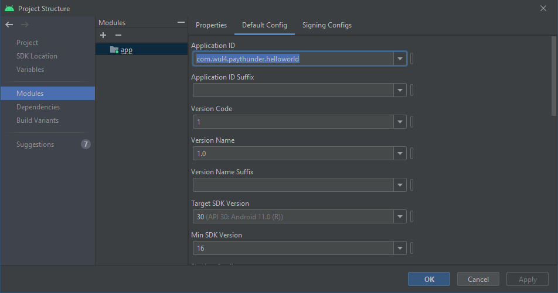

App base para crear apps con Modo Kiosko en pantalla completa en combinación con un administrador de dispositivo como P̶̷a̶̷y̶̷T̶̷h̶̷u̶̷n̶̷d̶̷e̶̷r̶̷ ̶̷U̶̷p̶̷d̶̷a̶̷t̶̷e̶̷r̶̷  PayThunder Device Admin.

IMPORTANTE: Antes de usar este proyecto como base para otro, hay que cambiar el Application ID en la estructura del proyecto o en el build.gradle (no basta con solo cambiar el nombre del paquete). Si no, todas las apps generadas en base a este proyecto tendrán el mismo ID.

